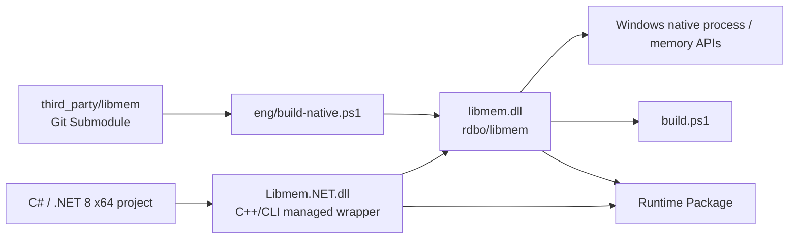

# Libmem.NET — libmem 5.x C++/CLI wrapper (Windows x64 / .NET 8)

[简体中文](README.md) | [English](README.en.md)

[](https://github.com/HearthstoneModding/Libmem.NET/actions/workflows/build.yml)
[](LICENSE)


Libmem.NET is a reusable .NET / C++/CLI wrapper around the C ABI of [rdbo/libmem](https://github.com/rdbo/libmem). The managed assembly, namespace, and binary names are unified as `Libmem.NET`. This is a breaking identity change: existing consumers must update namespaces, assembly references, and paths, then recompile. See the [migration guide](docs/MIGRATION.md). Public types and member behavior are preserved. **The stable line, CI acceptance, and official releases target Windows x64 / .NET 8.** Existing x86 code and build configurations are retained for now, but x86 is deferred and is not a near-term development or release target.

See [ROADMAP.en.md](ROADMAP.en.md) for the current development plan, the [API reference](docs/API.md) for consumer-facing result/exception/lifetime semantics, and the [consumption guide](docs/CONSUMPTION.md) for ZIP, submodule, and NuGet options.

Except for explicitly documented compatibility waivers, the wrapper covers the public functions in the pinned libmem header through managed models, managed byte arrays, and .NET-friendly APIs. Normal libmem functions and their `Ex` variants are generally represented as overload pairs.

The native libmem library is included as a pinned Git submodule and is built automatically before the C++/CLI wrapper.

- Upstream project: [rdbo/libmem](https://github.com/rdbo/libmem)
- C API: [include/libmem/libmem.h](https://github.com/rdbo/libmem/blob/master/include/libmem/libmem.h)


## Architecture



The runtime call chain is **C#/.NET → Libmem.NET.dll → libmem.dll → Windows Native API**. During builds, the pinned libmem submodule produces the native DLL first, followed by the C++/CLI managed wrapper.

## Requirements

- Windows x64 (current supported development and release target)
- x86 build configuration is retained only for future restoration or manual compatibility checks and is not part of the current support commitment
- Visual Studio with:
  - **Desktop development with C++**
  - **C++/CLI support for the v143 build tools**
- Windows SDK
- .NET 8 SDK
- CMake
- Git

## Clone and build

Clone recursively so the pinned libmem source and its dependencies are available:

```powershell
git clone --recursive https://github.com/HearthstoneModding/Libmem.NET.git
cd Libmem.NET
.\build.ps1 -Configuration Release
```

`build.ps1` will:

1. initialize all Git submodules;
2. build the pinned native libmem library;
3. stage native headers, import libraries, and runtime DLLs;
4. build the C++/CLI solution.

`bootstrap.ps1` remains available as a compatibility alias.

You can also open `Libmem.NET.sln` directly and build `Debug|x64` or `Release|x64`. Visual Studio/MSBuild will perform the same native prerequisite build automatically. The repository still contains x86 configurations, but they are not part of the primary development path, default CI, or official releases.

Generated files are kept outside the source directories:

```text
artifacts/native/x64/Release/bin/libmem.dll
artifacts/native/x64/Release/lib/libmem.lib
artifacts/managed/x64/Release/Libmem.NET.dll
artifacts/managed/x64/Release/Libmem.NET.xml
artifacts/managed/x64/Release/Ijwhost.dll
```


## C# quick example

After referencing `Libmem.NET.dll`, managed code can access process and module information directly:

```csharp
using Libmem.NET;
using NativeApi = global::Libmem.NET.Libmem;

var process = NativeApi.CurrentProcess()
    ?? throw new InvalidOperationException("Current process not found");

using var session = ProcessSession.Open(process)
    ?? throw new InvalidOperationException("Attach failed");

Console.WriteLine(
    $"Process: {process.Name}  PID={process.Pid}  Arch={process.Architecture}  Bits={process.Bits}");

foreach (var module in session.Modules.Enumerate())
{
    Console.WriteLine(
        $"{module.Name}  Base=0x{module.Base:X}  Size=0x{module.Size:X}");
}
```

See [`samples/Example.cs`](samples/Example.cs) for the complete runnable consumer example. It uses the recommended `ProcessSession` / Manager APIs and only operates on isolated memory owned by the sample process.

At runtime, keep `Libmem.NET.dll`, `Ijwhost.dll`, and `libmem.dll` beside the application executable. Keep `Libmem.NET.xml` beside the managed assembly as well when IntelliSense API documentation is desired in Visual Studio / C# editors.

## ProcessSession

`ProcessSession` is an optional general-purpose process context. It binds to one concrete process identity using **PID + process start time** and gives memory, module, hook, and injection calls for the same target an explicit Attach / Detach lifetime; it does not own application state:

```csharp
using var target = ProcessSession.Open("ExampleApp.exe");

if (target is null)
    return;

Console.WriteLine($"{target.Name} PID={target.Pid} Arch={target.Architecture}");

if (!target.IsAlive())
    return;

var latest = target.Refresh();
```

`ProcessSession` does not own a native Windows process handle. It acts as the aggregation root for `MemoryManager`, `ModuleManager`, `ThreadManager`, `ScanManager`, `SymbolManager`, `AssemblyManager`, `HookManager`, and `InjectorManager`; those subsystems only add target binding and necessary resource-lifetime constraints around libmem calls.

New code should prefer `ProcessSession.Open(...)`. Existing `NativeApi.Attach(...)` and static `NativeApi.*` APIs remain available for compatibility. Applications that need snapshots, caches, event state, or game-state models should build those models in the caller rather than in Libmem.NET.

### ModuleManager

`ProcessSession.Modules` exposes module operations bound to the target process:

```csharp
var modules = target.Modules;

foreach (var module in modules.Enumerate())
    Console.WriteLine($"{module.Name} 0x{module.Base:X}");

var unity = modules.Find("UnityPlayer.dll");
```

It currently provides `Enumerate / Find / Load / Unload`. Like `MemoryManager`, it follows the ProcessSession lifetime and rejects operations after Detach. `Find` still returns `null` for a normal miss, while a definite native `Load` failure throws `LibmemException`.

### ThreadManager

`ProcessSession.Threads` binds thread operations to the current process session:

```csharp
foreach (var thread in target.Threads.Enumerate())
    Console.WriteLine(thread.Id);

var mainThread = target.Threads.Main;
```

This phase intentionally wraps only the thread enumeration and process-main-thread capabilities already exposed by libmem. It does not invent Suspend / Resume / Context APIs that are outside the current native wrapper surface.

### ScanManager

Scanning and pointer resolution are now separated from raw memory read/write responsibilities. New code should use `ProcessSession.Scanner`:

```csharp
var hit = target.Scanner.SigScan("48 8B ?? ??", start, size);
var resolved = target.Scanner.DeepPointer(baseAddress, offsets);
```

`ScanManager` exposes `DeepPointer / DataScan / PatternScan / SigScan` as the canonical session-bound scanning surface. The temporary v0.x forwarding aliases on `MemoryManager` were removed before the v1.0 API freeze; the static `NativeApi.*` compatibility facade remains.

### SymbolManager

`ProcessSession.Symbols` owns symbol operations without turning `ModuleInfo` into an active service object:

```csharp
var symbols = target.Symbols.Enumerate(module, demangle: false);
var address = target.Symbols.FindAddress(module, "ExportedName", demangle: false);
```

It currently exposes symbol enumeration, address lookup, and demangling. The existing static `NativeApi.EnumSymbols / FindSymbolAddress / DemangleSymbol` APIs remain available for compatibility.

### AssemblyManager

`ProcessSession.Assembly` defaults to the target process `Architecture` for assembly, disassembly, and target code-length queries:

```csharp
var code = target.Assembly.Assemble("nop; ret", runtimeAddress);
var instructions = target.Assembly.Disassemble(code, 2, runtimeAddress);
var remote = target.Assembly.Disassemble(address, 32, 4, address);
var length = target.Assembly.CodeLength(address, 5);
```

The address-based `Disassemble` overload first reads bytes through the current session and then disassembles those bytes using the target architecture, so a remote address is never treated as a local pointer. At the Manager layer, definite `Assemble` failures and failed non-zero `CodeLength` queries throw `LibmemException`; existing static assembly/disassembly APIs remain compatibility entry points.

### Injector

`ProcessSession.Injector` is the higher-level DLL injection API above `ModuleManager.Load`. Its purpose is to make ownership of one LoadLibrary reference explicit:

```csharp
using var injected = target.Injector.InjectLibrary(@"C:\Mods\NativeBootstrap.dll");

Console.WriteLine($"0x{injected.Module.Base:X} {injected.Module.Name}");
```

`InjectLibrary` normalizes and validates the DLL path and rejects cross-bitness injection between the current runtime and target process. The returned `InjectedModuleHandle` preserves the managed module description and requested path. `IsActive` means **this handle still owns the load reference it created**; it does not claim that the module is the only loaded instance in the process.

Explicit `Unload()` returns the release result. `Dispose()` deterministically attempts to release the one `LoadLibrary` reference owned by the handle; if native cleanup fails, the failure is surfaced instead of silently marking live ownership as released. Because Windows DLLs are reference-counted and the pinned upstream `LM_UnloadModuleEx` only requests a release, a successful call does not guarantee the module disappears completely from the target process. The GC finalizer never calls `FreeLibrary` in the target process.

### HookManager

`ProcessSession.Hooks` binds hook installation to the current target process:

```csharp
using var hook = target.Hooks.Install(source, destination);

Console.WriteLine($"source=0x{hook.Source:X} destination=0x{hook.Destination:X} trampoline=0x{hook.Trampoline:X}");
```

`HookManager` does not aggregate ownership of installed hooks. Each returned `HookHandle` independently owns its hook and trampoline. `Source / Destination / Trampoline / PatchedBytes` preserve installation metadata; `Remove()` exposes the restoration result, while `Dispose()` deterministically restores the original code and throws `LibmemException` on failure instead of silently marking a live hook as released. The finalizer never rewrites process code from the GC thread. `ProcessSession.Detach()` prevents new installations without bulk-removing handles already returned to callers.

### MemoryManager

`ProcessSession.Memory` groups target-process memory operations into one session-bound API:

```csharp
var memory = target.Memory;

using var buffer = memory.Allocate(4096, MemoryProtection.ReadWrite);

memory.Write(buffer.Address, payload);
var copy = memory.Read(buffer.Address, payload.Length);
var hit = target.Scanner.SigScan("48 8B ?? ??", start, size);
```

Its core responsibility is Read / Write / ReadInt32 / WriteInt32 / Set / Protect / Allocate / Free. DeepPointer / DataScan / PatternScan / SigScan are exposed through `ProcessSession.Scanner`. It is bound to the `ProcessSession` lifetime; calls after the session is detached throw `ObjectDisposedException`. Manager operations such as `Allocate` that can identify a definite native failure throw `LibmemException` with the corresponding `Operation` instead of silently returning a failed address.

### RemoteAllocation

`ProcessSession.Allocate(...)` now returns a disposable `RemoteAllocation`, making ownership of target-process memory explicit:

```csharp
using var memory = target.Allocate(4096, MemoryProtection.ReadWrite);

Console.WriteLine($"0x{memory.Address:X} / {memory.Size} bytes");
```

Calling `Free()` explicitly lets callers inspect the release result. Leaving the `using` scope makes `Dispose()` deterministically release the allocation; if native cleanup fails, the failure is surfaced instead of silently discarding ownership. If the target process has already exited, its address space is considered reclaimed by the OS. The finalizer never mutates another process from the GC thread.

## XML API documentation

Release/runtime packages ship `Libmem.NET.xml` beside `Libmem.NET.dll`. The C++/CLI build enables MSVC `/doc` for public XML comments and XDCMake merges the generated XDC data into an XML file with the same base name as the assembly. When consumers keep both files together, Visual Studio can surface IntelliSense documentation for `ProcessSession`, subsystem managers, owned resource handles, Hook/VMT APIs, and the static compatibility facade.

## Consume as a Git submodule

Add this repository to another project as a submodule:

```powershell
git submodule add https://github.com/HearthstoneModding/Libmem.NET.git external/Libmem.NET
git submodule update --init --recursive
```

Then add:

```text
external/Libmem.NET/src/Libmem.NET.vcxproj
```

to the consuming solution and reference it from a matching-architecture .NET 8 project with a `ProjectReference`.

Build the full solution with Visual Studio MSBuild so the C++/CLI toolchain is available.

Project and output paths are based on this repository rather than the consuming solution, so the submodule may be placed at any stable location.

At runtime, deploy the following files beside the consuming executable:

- `Libmem.NET.dll`
- `Libmem.NET.xml` (IntelliSense XML documentation)
- `Ijwhost.dll`
- `libmem.dll`

Do not mix outputs from different configurations or commits.


## NuGet package

The repository has validated the **Windows x64 / .NET 8** `Libmem.NET` NuGet package with an independent `PackageReference` consumer. The official Release workflow now supports nuget.org Trusted Publishing (OIDC); before the first public publish, configure the nuget.org Trusted Publishing policy and the GitHub Actions `NUGET_USER` secret.

See [docs/CONSUMPTION.md](docs/CONSUMPTION.md) for the package layout and acceptance criteria. Until restore/build/run/publish behavior is fully accepted, the Release ZIP and Git submodule/reusable-workflow paths remain the stable consumption options.

## Release pages and release notes

Official releases no longer use GitHub's auto-generated pull-request feed as the primary release body. The release workflow generates **formal Release Notes** from the matching version section in `CHANGELOG.md` plus the verified package manifest, including release highlights, Windows x64 / .NET 8 support, download assets, package contents, SHA-256, repository commit, pinned libmem commit, and documentation links.

A matching version section must exist in `CHANGELOG.md` before publication; the release fails if it is missing, preventing PR/Actions-style placeholder pages.

## GitHub Actions automation

The repository retains seven workflow files; Build is the single automatic PR gate, and four specialized suites retain manual diagnostic entry points:

- `.github/workflows/build.yml`: builds Debug / Release x64 on pushes to `main`, pull requests, or manual runs; runs Example, Smoke, external-process, Hook/VMT, Injector, NuGet consumer, and package verification in one job; uploads the `Libmem.NET-windows-x64` artifact.
- \`.github/workflows/reusable-build.yml\`: exposes the build through \`workflow_call\` so other GitHub repositories can reuse it.
- \`.github/workflows/release.yml\`: builds, verifies, and publishes only the x64 package for `v*` tags or `release/v*` release branches. x86 release assets are not currently produced.
- \`.github/workflows/hook-vmt-tests.yml\`: manual diagnostic entry point; runs real Hook / trampoline / VMT lifecycle tests on x64 independently from the base smoke suite.
- \`.github/workflows/injector-tests.yml\`: manual diagnostic entry point; independently validates DLL injection, module discovery, explicit Unload, and Dispose lifetime behavior on x64.
- `.github/workflows/external-process-tests.yml`: manual diagnostic entry point; launches the repository-owned `Libmem.NET.TestTarget` child process and validates real cross-process attach, read/write, remote allocate/protect/free, signature scan, segment lookup, and process-exit observation.
- `.github/workflows/nuget-consumer-tests.yml`: manual diagnostic entry point; builds the local `Libmem.NET` NuGet package and validates pack → restore → run → publish through an independent `PackageReference` consumer; nuget.org publication is reserved for the Release workflow and uses OIDC.

You can create the same runtime package locally:

```powershell
.\build.ps1 -Configuration Release
.\eng\package-runtime.ps1 -Configuration Release
```

Output:

```text
artifacts/package/Libmem.NET-windows-x64/
artifacts/package/Libmem.NET-windows-x64.zip
artifacts/package/Libmem.NET-windows-x64.zip.sha256
```

## Versioning and automated validation

The root `VERSION` file is the source of truth for release versioning. The current version is **1.0.0**, and the generated `Libmem.NET.dll` carries matching assembly version metadata.

Each runtime package contains a `manifest.json` recording:

- the Libmem.NET package version;
- the repository Git commit;
- the pinned upstream libmem commit;
- target framework (`net8.0`);
- platform (official releases currently use `win-x64`);
- build configuration (Debug / Release);
- the file name, byte length, and SHA-256 of every packaged file.

Packaging also runs the shared `eng/verify-package.py` verifier. It checks every manifest file entry, byte length, and SHA-256, confirms the ZIP contains exactly the packaged directory contents, and validates the external `.zip.sha256`. Release publication additionally requires the manifest `repositoryCommit` to match the Git commit being released, preventing a correctly versioned package from being published from the wrong commit.

CI validates more than compilation:

1. **API Contract Check** parses the pinned submodule's `include/libmem/libmem.h` and extracts every public `LM_API`. Except for compatibility waivers that are explicitly documented in source with their rationale, CI fails if upstream exposes a public API that the C++/CLI wrapper does not cover.
2. **Runtime Smoke Tests** load `Libmem.NET.dll + libmem.dll` and cover process/command-line APIs, threads, modules/exported symbols, memory segments, allocation/read/write/set/protection, DeepPointer, Data/Pattern/Signature scanning, assembly/disassembly, and CodeLength. Controlled memory tests only touch isolated allocations in the test process itself.

Hook and VMT use a separate test project executed by the unified Build gate; `Hook VMT Runtime Tests` remains available for manual diagnosis. Explicit `VmtManager.Dispose()` also uses deterministic restoration: if any tracked VMT entry cannot be restored, the manager remains undisposed and throws `LibmemException` instead of discarding the remaining hook bookkeeping. It allocates isolated executable memory in the current process and verifies hook redirection, trampoline execution, Remove, and VMT Hook / Unhook / Reset / Dispose without depending on Hearthstone or any external process.

Injector tests also run in the unified Build gate; `Injector Runtime Tests` retains a manual diagnostic entry point. The test copies `libmem.dll` under a unique fixture name and performs real injection, module discovery, Unload, and Dispose against the current test process without depending on Hearthstone.

Cross-process behavior is validated by the unified Build gate; `External Process Runtime Tests` retains a manual diagnostic entry point. It launches the repository-owned `Libmem.NET.TestTarget` in a separate PID/address space and verifies `ProcessSession.Open(pid)`, process-identity checks, remote read/write, remote allocate/protect/free, scanning, segment lookup, and target-process exit observation.

### Reuse the build from another repository

Another repository can call the reusable workflow directly:

```yaml
jobs:
  build-libmem:
    uses: HearthstoneModding/Libmem.NET/.github/workflows/reusable-build.yml@main
    with:
      ref: main
      configuration: Release
      platform: x64
      artifact-name: Libmem.NET-windows-x64

  use-libmem:
    needs: build-libmem
    runs-on: windows-2022
    steps:
      - uses: actions/download-artifact@v4
        with:
          name: Libmem.NET-windows-x64
          path: external/Libmem.NET
```

The caller does not need to duplicate Libmem's build scripts; the artifact is uploaded directly to the caller's workflow run.

> While this repository is private, cross-repository reuse requires GitHub Actions access settings that allow the caller repository to use this reusable workflow. If the repository becomes public later, public repositories can reference it directly.

## API stability

The repository commits a shared public API baseline at `api/Libmem.NET.PublicApi.txt`. Every `tests/check_sources.py` run extracts the actual public types, properties, methods, and enum members from `src/Libmem.NET.h` and compares them with that baseline.

Accidental removals, signature changes, public-member renames, or enum changes therefore fail CI. An intentional public API change must explicitly run:

```powershell
python .\eng\check-public-api.py --write
```

Then review the API diff, update `CHANGELOG.md`, and apply the appropriate version change. Starting with v1.0, public API and managed-contract changes are expected to remain backward compatible by default; any intentional breaking change must be explicit, reviewed, documented, and versioned accordingly.

## Error model

When Libmem.NET can determine that a **native libmem operation definitely failed**, it throws `LibmemException`. The type derives from `InvalidOperationException` and preserves the corresponding native operation name through the `Operation` property, for example `LM_EnumProcesses`, `LM_ProtMemoryEx`, or `LM_FreeMemoryEx`.

`Find*` operations, scan misses, and APIs where upstream libmem uses `null` / `LM_ADDRESS_BAD` as the normal “not found” result keep their existing return semantics. The wrapper does not turn ordinary misses into exceptions merely for uniformity.

Argument validation continues to use the standard .NET `ArgumentException` family, while lifetime misuse continues to use `ObjectDisposedException`.

## API mapping

### Processes

The following libmem APIs are exposed through `Libmem` process methods:

- `LM_EnumProcesses`
- `LM_GetProcess`
- `LM_GetProcessEx`
- `LM_FindProcess`
- `LM_IsProcessAlive`
- `LM_GetCommandLine`
- `LM_FreeCommandLine`
- `LM_GetBits`
- `LM_GetSystemBits`

> Compatibility note: `LM_GetCommandLine` / `LM_FreeCommandLine` are explicit waivers for the pinned Windows upstream revision. Managed `NativeApi.GetCommandLine` preserves the intended contract without executing those unsafe native entry points.

### Threads, modules, symbols, and segments

Thread, module, symbol, and segment `LM_*` enumeration/find/get/load/unload APIs are mapped to their corresponding `Libmem` methods.

Enumeration results are fully materialized as managed `List<T>` values.

### Memory operations

The following APIs are exposed as overloads with or without a `ProcessInfo` argument:

- `LM_ReadMemory[Ex]`
- `LM_WriteMemory[Ex]`
- `LM_SetMemory[Ex]`
- `LM_ProtMemory[Ex]`
- `LM_AllocMemory[Ex]`
- `LM_FreeMemory[Ex]`
- `LM_DeepPointer[Ex]`

### Scanning

The following APIs are exposed as managed byte/string scanning methods:

- `LM_DataScan[Ex]`
- `LM_PatternScan[Ex]`
- `LM_SigScan[Ex]`

### Assembly and disassembly

Assembly/disassembly APIs are exposed through:

- `NativeApi.Assemble`
- `NativeApi.Disassemble`
- `NativeApi.CodeLength`
- `NativeApi.GetArchitecture`

Native assembly-result buffers are freed after being copied into managed memory.

### Hooks

- `LM_HookCode[Ex]` → `NativeApi.HookCode`
- `LM_UnhookCode[Ex]` → disposable `HookHandle`

`HookHandle` now separates **whether the hook is still installed** from **whether the managed handle is disposed**:

- `Source / Trampoline / PatchedBytes` retain installation metadata;
- `IsInstalled` reports whether the handle still considers the target code hooked;
- `IsDisposed` reports whether the managed lifetime has ended;
- `Remove()` attempts to unhook and clears `IsInstalled` only on success;
- `Dispose()` deterministically attempts to unhook; if native restoration fails it throws `LibmemException` and leaves `IsInstalled=true` rather than silently reporting the live hook as released.

This prevents a failed removal from being reported as a successful unhook. The finalizer still never modifies target-process code from the GC thread.

The native VMT API is wrapped by the disposable `VmtManager`. In the pinned libmem revision, `LM_VmtReset` reads an entry index again after freeing that entry. `VmtManager.Reset / Dispose` therefore remove tracked entries one-by-one with `LM_VmtUnhook` first, then call the upstream Reset/Free only after the list is empty, avoiding that use-after-free path. The GC finalizer never rewrites VTable entries; if explicit `Dispose` is skipped while hooks remain active, a small amount of native bookkeeping may leak rather than mutating the table from the GC thread.

## Important behavior and limitations

1. **The current official development, default CI, and Release target is Windows x64.** x86-related code and build configurations remain in the repository but are deferred: they are not a near-term acceptance target, new x64 work is not required to maintain feature parity with x86, and no x86 Release package is published. If x86 development resumes, it will receive a dedicated compatibility audit and restored test matrix. Remote injection still requires the current runtime and target process to have matching bitness.

2. `ReadMemory` returns **only the bytes actually read**. `WriteMemory` returns the actual number of bytes written. Callers should check for short reads and partial writes. A zero-byte result may indicate an inaccessible address.

3. `ProcessInfo` and `ModuleInfo` are snapshots, not operating-system handles. A process can exit and module/address information can become stale. `IsProcessAlive` checks the original identity using `pid` plus startup time.

4. `GetCommandLine` currently supports the **current process only**. The pinned Windows upstream `LM_GetCommandLine` has undefined behavior at this revision, so Libmem.NET does not invoke it; current-process arguments come from `System.Environment.GetCommandLineArgs()`, while other processes preserve the upstream unsupported behavior and return `null`. Enumeration callbacks are synchronous.

5. `Disassemble(codeAddress, arch, ...)` expects `codeAddress` to point to readable machine code in the **calling process**, not a remote-process address. For remote code, call `ReadMemory` first and pass the resulting byte array to the safe pinned-buffer `Disassemble(byte[], ...)` overload.

6. Hooks require executable native targets and replacements with the correct calling convention, signature, architecture, and lifetime. **A C# delegate address is not automatically a safe detour.** For a remote hook, `destination` must refer to code in the **remote process**; this wrapper does not inject that code for you. Dispose `HookHandle` explicitly while the target code and process are still valid. Its finalizer intentionally does not restore modified code from a GC thread.

7. The VMT manager is **local-process only**. Dispose it while the original vtable is still valid and do not use arbitrary or untrusted addresses. Internal VMT entries are not automatically synchronized with concurrent modifications.

8. Allocation, modification, and free operations are low-level APIs and require matching region sizes and protection settings. Some native APIs operate at page granularity. `ProcessInfo` does not own these allocations, so disposing it does not implicitly call `VirtualFree` or restore memory permissions.

9. Runtime deployment requires matching copies of:
   - `libmem.dll`
   - the .NET C++/CLI `Ijwhost.dll`

   beside the consuming executable.

## License

This C++/CLI wrapper repository is distributed under **GNU AGPL-3.0-only**.

The pinned upstream libmem submodule uses the same license.

See the following for details:

- `LICENSE`
- `THIRD_PARTY_NOTICES.md`
- the upstream libmem submodule license and corresponding source
