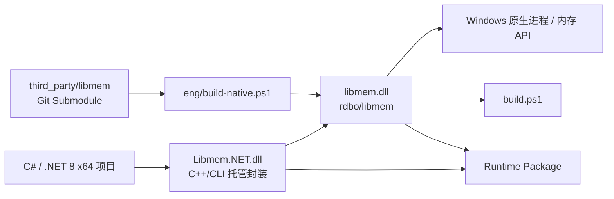

# Libmem.NET — libmem 5.x C++/CLI 封装（Windows x64 / .NET 8）

[简体中文](README.md) | [English](README.en.md)

[](https://github.com/HearthstoneModding/Libmem.NET/actions/workflows/build.yml)
[](LICENSE)


Libmem.NET 是对 [rdbo/libmem](https://github.com/rdbo/libmem) C ABI 的可复用 .NET / C++/CLI 封装。托管程序集、命名空间与二进制名称统一为 `Libmem.NET`。这是一次兼容性变更：旧消费者需更新命名空间、程序集引用及路径并重新编译，详见 [迁移指南](docs/MIGRATION.md)。公开类型和成员行为保持原样。**稳定主线与正式发布目标为 Windows x64 / .NET 8。** 现有 x86 代码与构建配置暂时保留，但 x86 已延后，不再作为近期开发目标或正式 Release 产物。

开发路线见 [ROADMAP.md](ROADMAP.md)，消费者行为与返回/异常/生命周期语义见 [API 参考](docs/API.md)，ZIP / Submodule / NuGet 等消费方式见 [消费指南](docs/CONSUMPTION.md)。

除明确记录的兼容性豁免外，本项目覆盖当前固定版本 libmem 头文件中的公开函数，并使用托管模型、托管字节数组以及符合 .NET 使用习惯的 API 暴露给 C# / .NET。libmem 中普通函数与 `Ex` 函数通常在托管层对应为一组重载。

原生 libmem 以固定版本的 Git Submodule 引入，并会在构建 C++/CLI 封装前自动编译。

- 上游项目：[rdbo/libmem](https://github.com/rdbo/libmem)
- C API：[include/libmem/libmem.h](https://github.com/rdbo/libmem/blob/master/include/libmem/libmem.h)


## 项目架构



运行时调用链为 **C#/.NET → Libmem.NET.dll → libmem.dll → Windows Native API**。构建时则由仓库固定的 libmem Submodule 生成原生 DLL，再构建 C++/CLI 托管封装。

## 环境要求

- Windows x64（当前正式开发与发布目标）
- x86 构建配置暂时保留，仅用于未来恢复或手动兼容验证，不作为当前支持承诺
- Visual Studio，并安装：
  - **使用 C++ 的桌面开发**
  - **适用于 v143 生成工具的 C++/CLI 支持**
- Windows SDK
- .NET 8 SDK
- CMake
- Git

## 克隆与构建

请使用递归方式克隆仓库，以确保固定版本的 libmem 源码及其依赖同时被拉取：

```powershell
git clone --recursive https://github.com/HearthstoneModding/Libmem.NET.git
cd Libmem.NET
.\build.ps1 -Configuration Release
```

`build.ps1` 会自动完成：

1. 初始化所有 Git Submodule；
2. 编译固定版本的原生 libmem；
3. 整理原生头文件、导入库和运行时 DLL；
4. 构建 C++/CLI 解决方案。

`bootstrap.ps1` 仍保留为兼容入口。

也可以直接打开 `Libmem.NET.sln`，使用 `Debug|x64` 或 `Release|x64` 构建。Visual Studio/MSBuild 会自动执行相同的原生依赖构建流程。仓库仍保留 x86 配置，但当前不把它作为主线开发、默认 CI 或正式发布目标。

生成文件不会写入源码目录，默认输出到：

```text
artifacts/native/x64/Release/bin/libmem.dll
artifacts/native/x64/Release/lib/libmem.lib
artifacts/managed/x64/Release/Libmem.NET.dll
artifacts/managed/x64/Release/Libmem.NET.xml
artifacts/managed/x64/Release/Ijwhost.dll
```


## C# 快速示例

引用 `Libmem.NET.dll` 后，可以直接通过托管 API 获取当前进程与模块信息：

```csharp
using Libmem.NET;
using NativeApi = global::Libmem.NET.Libmem;

var process = NativeApi.CurrentProcess()
    ?? throw new InvalidOperationException("Current process not found");

using var session = ProcessSession.Open(process)
    ?? throw new InvalidOperationException("Attach failed");

Console.WriteLine(
    $"Process: {process.Name}  PID={process.Pid}  Arch={process.Architecture}  Bits={process.Bits}");

foreach (var module in session.Modules.Enumerate())
{
    Console.WriteLine(
        $"{module.Name}  Base=0x{module.Base:X}  Size=0x{module.Size:X}");
}
```

完整的可运行消费者示例见 [`samples/Example.cs`](samples/Example.cs)，示例使用推荐的 `ProcessSession` / Manager API，并只操作示例进程自己的隔离内存。

运行时请确保 `Libmem.NET.dll`、`Ijwhost.dll` 和 `libmem.dll` 位于应用程序可执行文件旁。建议同时保留同目录的 `Libmem.NET.xml`，Visual Studio / C# 编辑器可据此显示 Libmem.NET 的 IntelliSense API 说明。

## ProcessSession

`ProcessSession` 是可选的通用进程上下文封装。它通过 **PID + 进程启动时间** 锁定一个具体进程身份，并为同一目标的内存、模块、Hook 与注入操作提供明确的 Attach / Detach 生命周期；它不承担应用状态管理：

```csharp
using var target = ProcessSession.Open("ExampleApp.exe");

if (target is null)
    return;

Console.WriteLine($"{target.Name} PID={target.Pid} Arch={target.Architecture}");

if (!target.IsAlive())
    return;

var latest = target.Refresh();
```

当前 `ProcessSession` 不持有 Windows 原生进程句柄；它作为聚合入口，向下组合 `MemoryManager`、`ModuleManager`、`ThreadManager`、`ScanManager`、`SymbolManager`、`AssemblyManager`、`HookManager` 和 `InjectorManager`。这些子系统只是在 libmem 调用之上增加目标绑定与必要的资源生命周期约束。

新代码推荐使用 `ProcessSession.Open(...)`；现有 `NativeApi.Attach(...)` 和 `NativeApi.*` 静态 API 继续保留兼容。应用如果需要 Snapshot、缓存、事件状态或游戏状态模型，应在调用方自己构建，而不是放进 Libmem.NET。

### ModuleManager

`ProcessSession.Modules` 提供与目标进程绑定的模块操作：

```csharp
var modules = target.Modules;

foreach (var module in modules.Enumerate())
    Console.WriteLine($"{module.Name} 0x{module.Base:X}");

var unity = modules.Find("UnityPlayer.dll");
```

当前提供 `Enumerate / Find / Load / Unload`。它和 `MemoryManager` 一样遵循 Session 生命周期，Detach 后不可继续操作。`Find` 未找到仍返回 `null`，而 `Load` 的明确原生失败会抛出 `LibmemException`。

### ThreadManager

`ProcessSession.Threads` 将目标进程线程能力绑定到当前 Session：

```csharp
foreach (var thread in target.Threads.Enumerate())
    Console.WriteLine(thread.Id);

var mainThread = target.Threads.Main;
```

当前阶段只封装 libmem 已有的线程枚举与进程主线程查询，不额外引入 Suspend / Resume / Context 等 libmem 尚未提供的能力。

### ScanManager

扫描与指针解析从内存读写职责中独立出来，新代码推荐通过 `ProcessSession.Scanner` 使用：

```csharp
var hit = target.Scanner.SigScan("48 8B ?? ??", start, size);
var resolved = target.Scanner.DeepPointer(baseAddress, offsets);
```

`ScanManager` 提供 `DeepPointer / DataScan / PatternScan / SigScan`，并作为 session-bound 扫描的唯一入口。v0.x 早期暂存在 `MemoryManager` 上的同名转发方法已在 v1.0 API Freeze 前移除；静态 `NativeApi.*` 兼容接口继续保留。

### SymbolManager

`ProcessSession.Symbols` 负责模块符号能力，不把行为塞进 `ModuleInfo` 数据对象：

```csharp
var symbols = target.Symbols.Enumerate(module, demangle: false);
var address = target.Symbols.FindAddress(module, "ExportedName", demangle: false);
```

当前提供符号枚举、地址查找与 Demangle；原有 `NativeApi.EnumSymbols / FindSymbolAddress / DemangleSymbol` 静态 API 保持兼容。

### AssemblyManager

`ProcessSession.Assembly` 默认使用目标进程的 `Architecture`，用于汇编、反汇编和目标代码长度计算：

```csharp
var code = target.Assembly.Assemble("nop; ret", runtimeAddress);
var instructions = target.Assembly.Disassemble(code, 2, runtimeAddress);
var remote = target.Assembly.Disassemble(address, 32, 4, address);
var length = target.Assembly.CodeLength(address, 5);
```

地址版 `Disassemble` 会先通过当前 Session 从目标进程读取字节，再按目标架构进行反汇编，因此不会把远程地址直接当成本地指针使用。Manager 层的 `Assemble` 和非零最小长度的 `CodeLength` 在能够明确判断原生失败时会抛出 `LibmemException`；原有静态 Assembly / Disassembly API 继续作为兼容入口保留。

### Injector

`ProcessSession.Injector` 是比 `ModuleManager.Load` 更高一层的 DLL 注入接口，用来表达“这一次 LoadLibrary 引用由谁负责释放”：

```csharp
using var injected = target.Injector.InjectLibrary(@"C:\Mods\NativeBootstrap.dll");

Console.WriteLine($"0x{injected.Module.Base:X} {injected.Module.Name}");
```

`InjectLibrary` 会规范化并检查 DLL 路径，并拒绝当前 runtime 与目标进程位宽不同的跨位宽注入。返回的 `InjectedModuleHandle` 保存模块描述与请求路径；`IsActive` 表示**这个 Handle 所拥有的一次加载引用尚未释放**，并不等价于“该 DLL 一定仍是目标进程中的唯一实例”。

显式 `Unload()` 会返回释放结果；`Dispose()` 会确定性尝试释放该 Handle 所拥有的一次 `LoadLibrary` 引用，失败时会向调用方报告，而不会把仍然有效的所有权静默标记为已释放。由于 Windows DLL 引用计数以及固定 libmem 上游 `LM_UnloadModuleEx` 的语义，即使调用成功，也不承诺模块一定完全从目标进程消失。GC Finalizer 不会对目标进程执行 `FreeLibrary`。

### HookManager

`ProcessSession.Hooks` 把 Hook 安装操作绑定到当前目标进程：

```csharp
using var hook = target.Hooks.Install(source, destination);

Console.WriteLine($"source=0x{hook.Source:X} destination=0x{hook.Destination:X} trampoline=0x{hook.Trampoline:X}");
```

`HookManager` 本身不接管已创建 Hook 的所有权；返回的 `HookHandle` 负责自己的 `Remove / Dispose` 生命周期。这样 `ProcessSession.Detach()` 只阻止继续安装新 Hook，不会在调用方没有明确要求时批量修改目标代码。保存下来的 `HookManager` 在 Session Detach 后继续使用会抛出 `ObjectDisposedException`。

### MemoryManager

`ProcessSession.Memory` 将目标进程内存操作收拢为一个 session-bound API：

```csharp
var memory = target.Memory;

using var buffer = memory.Allocate(4096, MemoryProtection.ReadWrite);

memory.Write(buffer.Address, payload);
var copy = memory.Read(buffer.Address, payload.Length);
var hit = target.Scanner.SigScan("48 8B ?? ??", start, size);
```

当前核心职责是 Read / Write / ReadInt32 / WriteInt32 / Set / Protect / Allocate / Free。DeepPointer / DataScan / PatternScan / SigScan 统一由 `ProcessSession.Scanner` 提供。Manager 与 `ProcessSession` 生命周期绑定；Session Detach 后继续调用会抛出 `ObjectDisposedException`。对于 `Allocate` 这类能够明确判断为原生操作失败的 Manager 调用，会抛出带有对应 `Operation` 的 `LibmemException`，而不是静默返回失败地址。

### RemoteAllocation

`ProcessSession.Allocate(...)` 现在返回可释放的 `RemoteAllocation`，用于明确表示“这块目标进程内存由当前对象拥有”：

```csharp
using var memory = target.Allocate(4096, MemoryProtection.ReadWrite);

Console.WriteLine($"0x{memory.Address:X} / {memory.Size} bytes");
```

显式调用 `Free()` 可以检查释放是否成功；离开 `using` 作用域时，`Dispose()` 会确定性释放这块内存，若原生释放失败则直接向调用方报告失败，而不会静默丢失所有权。如果目标进程已经退出，则视为地址空间已被操作系统回收。Finalizer 不会在 GC 线程里修改其他进程内存。

## XML API 文档

Release / Runtime package 会把 `Libmem.NET.xml` 与 `Libmem.NET.dll` 一起发布。C++/CLI 编译使用 MSVC `/doc` 处理公开 API 上的 XML 注释，再由 XDCMake 合并成与程序集同名的 XML 文件。消费者将两者放在同一目录后，Visual Studio 可以为 `ProcessSession`、各 Manager、资源句柄、Hook/VMT 和静态兼容 API 提供 IntelliSense 说明。

## 作为 Git Submodule 引用

可以在其他项目中将本仓库作为 Submodule 引入：

```powershell
git submodule add https://github.com/HearthstoneModding/Libmem.NET.git external/Libmem.NET
git submodule update --init --recursive
```

然后将：

```text
external/Libmem.NET/src/Libmem.NET.vcxproj
```

加入使用方解决方案，并在相同架构的 .NET 8 项目中通过 `ProjectReference` 引用它。

建议使用完整的 Visual Studio MSBuild 构建整个解决方案，以确保 C++/CLI 工具链可用。

项目路径和输出路径均基于 Libmem.NET 仓库自身，而不是使用方解决方案，因此 Submodule 可以放在任意稳定目录中。

运行时需要将以下文件部署到使用方可执行文件同目录：

- `Libmem.NET.dll`
- `Libmem.NET.xml`（IntelliSense XML 文档）
- `Ijwhost.dll`
- `libmem.dll`

请勿混用不同构建配置或不同提交生成的文件。


## NuGet 包

仓库已经完成 **Windows x64 / .NET 8** 的 `Libmem.NET` NuGet 包消费验证。正式 Release 流程已接入 nuget.org Trusted Publishing（OIDC）；首次公开发布前只需在 nuget.org 建立 Trusted Publishing policy，并在 GitHub Actions 配置 `NUGET_USER`。

原型打包和验收细节见 [docs/CONSUMPTION.md](docs/CONSUMPTION.md)。在 NuGet 通过 restore / build / run / publish 全链路验证之前，正式消费仍优先使用 Release ZIP 或 Git Submodule / reusable workflow。

## Release 页面与发布说明

正式 Release 不再直接使用 GitHub 自动生成的 PR 列表作为正文。发布工作流会从对应版本的 `CHANGELOG.md` 与已验证的 package manifest 自动生成**正式 Release Notes**，内容包括版本重点、Windows x64 / .NET 8 支持范围、下载资产、包内容、SHA-256、源码 commit、固定 libmem commit 与文档链接。

发布前必须先在 `CHANGELOG.md` 中建立对应版本章节；如果版本章节缺失，发布会直接失败，避免生成只有 Action / PR 链接的 Release 页面。

## GitHub Actions 自动构建

仓库保留七个工作流文件；PR 自动验证集中在 Build，四个专项测试入口用于手动诊断：

- `.github/workflows/build.yml`：向 `main` 推送、创建 PR 或手动运行时构建 Debug / Release x64，并集中运行 Example、Smoke、跨进程、Hook/VMT、Injector、NuGet 消费与包校验，上传 `Libmem.NET-windows-x64` Artifact。
- \`.github/workflows/reusable-build.yml\`：可被其他 GitHub 仓库通过 \`workflow_call\` 直接复用。
- \`.github/workflows/release.yml\`：推送 `v*` 标签或 `release/v*` 发布分支时只构建、校验并发布 x64 包。x86 暂不生成正式 Release 资产。
- \`.github/workflows/hook-vmt-tests.yml\`：手动诊断入口；在 x64 上独立运行真实 Hook / trampoline / VMT 生命周期测试，与基础 Smoke Test 分离。
- \`.github/workflows/injector-tests.yml\`：手动诊断入口；在 x64 上独立验证 DLL 注入、模块发现、显式 Unload 与 Dispose 生命周期。
- `.github/workflows/external-process-tests.yml`：手动诊断入口；启动仓库自带的 `Libmem.NET.TestTarget` 子进程，验证真实跨进程 Attach、Read/Write、远程 Allocate/Protect/Free、Signature Scan、Segment 与进程退出检测。
- `.github/workflows/nuget-consumer-tests.yml`：手动诊断入口；构建本地 `Libmem.NET` NuGet 包，通过独立 `PackageReference` 消费者执行 pack → restore → run → publish 验证；正式 nuget.org 发布仅由 Release workflow 通过 OIDC 执行。

本地也可以生成与 CI 相同的 Runtime 包：

```powershell
.\build.ps1 -Configuration Release
.\eng\package-runtime.ps1 -Configuration Release
```

输出：

```text
artifacts/package/Libmem.NET-windows-x64/
artifacts/package/Libmem.NET-windows-x64.zip
artifacts/package/Libmem.NET-windows-x64.zip.sha256
```

## 版本与自动验证

项目使用根目录的 `VERSION` 文件作为发布版本来源，当前版本为 **1.0.0**。构建后的 `Libmem.NET.dll` 会写入对应的程序集版本信息。

Runtime 包中的 `manifest.json` 会记录：

- Libmem.NET 包版本；
- 当前仓库 Git commit；
- 固定的上游 libmem commit；
- 目标框架（`net8.0`）；
- 平台（当前正式发布为 `win-x64`）；
- 构建配置（Debug / Release）；
- 包内每个实际文件的文件名、字节数和 SHA-256。

打包后还会运行统一的 `eng/verify-package.py`：逐项核对 manifest 中的文件清单、大小、SHA-256，确认 ZIP 内容与目录内容一致，并验证外部 `.zip.sha256`。Release 发布时还会要求 manifest 的 `repositoryCommit` 必须等于本次发布的 Git commit，避免“版本号对了但包来自别的提交”。

CI 不只检查“能否编译”，还会执行两层自动验证：

1. **API Contract Check**：直接解析固定 Submodule 中的 `include/libmem/libmem.h`，提取所有公开 `LM_API`；除源码中明确记录并解释原因的兼容性豁免外，如果上游新增公开 API 但 C++/CLI wrapper 尚未覆盖，构建会失败。
2. **Runtime Smoke Tests**：实际加载 `Libmem.NET.dll + libmem.dll`，覆盖进程/命令行、线程、模块/导出符号、内存段、内存申请/读写/填充/保护、DeepPointer、Data/Pattern/Signature Scan、汇编/反汇编与 CodeLength。所有可控的内存测试都只操作测试进程自己的隔离分配。

Hook / VMT 使用独立测试工程，由集中 Build 门禁运行；`Hook VMT Runtime Tests` 保留手动诊断入口。 `VmtManager` 的显式 `Dispose()` 同样采用确定性恢复：若任一已跟踪 VMT 项无法恢复，对象保持未释放状态并抛出 `LibmemException`，不会丢掉剩余 hook bookkeeping。该测试会在当前进程分配隔离的可执行内存，验证 Hook 重定向、trampoline、Remove，以及 VMT Hook / Unhook / Reset / Dispose，不依赖炉石或其他外部进程。

Injector 同样使用独立的 `Injector Runtime Tests`：测试会复制一份唯一文件名的 `libmem.dll` 作为隔离 fixture，在当前测试进程中实际执行注入、模块枚举、Unload 和 Dispose，避免依赖炉石进程。

跨进程测试由集中 Build 门禁运行，`External Process Runtime Tests` 保留手动诊断入口。测试启动仓库自带的 `Libmem.NET.TestTarget`，在独立 PID/地址空间上验证 `ProcessSession.Open(pid)`、目标身份校验、远程读写、远程分配/保护/释放、扫描、Segment 查询和进程退出检测。

### 在其他项目中复用构建工作流

其他仓库可以直接调用本仓库的构建工作流：

```yaml
jobs:
  build-libmem:
    uses: HearthstoneModding/Libmem.NET/.github/workflows/reusable-build.yml@main
    with:
      ref: main
      configuration: Release
      platform: x64
      artifact-name: Libmem.NET-windows-x64

  use-libmem:
    needs: build-libmem
    runs-on: windows-2022
    steps:
      - uses: actions/download-artifact@v4
        with:
          name: Libmem.NET-windows-x64
          path: external/Libmem.NET
```

这样调用方无需复制 Libmem.NET 的编译脚本，构建产物会直接出现在调用方的 Workflow Run 中。

> 当前仓库为私有仓库时，跨仓库复用需要在 GitHub Actions 的仓库/组织访问设置中允许调用方仓库访问该 reusable workflow；如果以后将仓库公开，则公开仓库可直接引用。

## API 稳定性

仓库提交了一份公共 API 基线：`api/Libmem.NET.PublicApi.txt`。每次 `tests/check_sources.py` 运行时，都会从 `src/Libmem.NET.h` 提取实际公开类型、属性、方法和枚举，并与这份基线比较。

这意味着误删方法、修改参数/返回类型、重命名公开成员或改变公开枚举成员都会直接让 CI 失败。确实需要调整公共 API 时，必须显式运行：

```powershell
python .\eng\check-public-api.py --write
```

然后同时审查 API diff、更新 `CHANGELOG.md`，并按变更性质处理版本号。从 v1.0 开始，public API 与 managed contract 默认保持向后兼容；任何有意的 breaking change 都必须显式审查、记录并按语义版本规则处理。

## 错误模型

对于能够明确判断为 **native libmem 操作失败** 的情况，Libmem.NET 统一抛出 `LibmemException`。它继承自 `InvalidOperationException`，并通过 `Operation` 属性保留对应的原生操作名，例如 `LM_EnumProcesses`、`LM_ProtMemoryEx`、`LM_FreeMemoryEx`。

`Find*`、Scan 未命中、以及上游本身用 `null` / `LM_ADDRESS_BAD` 表示正常“未找到”的接口仍保持原有返回语义，不会为了统一异常而把正常未命中改成错误。

参数错误继续使用 .NET 标准的 `ArgumentException` / `ArgumentNullException` / `ArgumentOutOfRangeException`；对象生命周期错误继续使用 `ObjectDisposedException`。

## API 映射

### 进程

以下 libmem API 映射为 `Libmem` 的进程相关方法：

- `LM_EnumProcesses`
- `LM_GetProcess`
- `LM_GetProcessEx`
- `LM_FindProcess`
- `LM_IsProcessAlive`
- `LM_GetCommandLine`
- `LM_FreeCommandLine`
- `LM_GetBits`
- `LM_GetSystemBits`

> 兼容性说明：固定 Windows 上游中的 `LM_GetCommandLine` / `LM_FreeCommandLine` 当前被列为显式兼容性豁免。托管 `NativeApi.GetCommandLine` 保留预期调用语义，但不会执行这两个存在风险的原生入口。

### 线程、模块、符号与内存段

线程、模块、符号和 Segment 相关的 `LM_*` 枚举、查找、获取、加载与卸载函数会映射到 `Libmem` 中对应的方法。

枚举结果会完整转换为托管 `List<T>`。

### 内存操作

以下 API 在托管层提供带或不带 `ProcessInfo` 参数的重载：

- `LM_ReadMemory[Ex]`
- `LM_WriteMemory[Ex]`
- `LM_SetMemory[Ex]`
- `LM_ProtMemory[Ex]`
- `LM_AllocMemory[Ex]`
- `LM_FreeMemory[Ex]`
- `LM_DeepPointer[Ex]`

### 扫描

以下 API 映射为托管字节数组或字符串扫描方法：

- `LM_DataScan[Ex]`
- `LM_PatternScan[Ex]`
- `LM_SigScan[Ex]`

### 汇编与反汇编

汇编/反汇编相关 API 映射为：

- `NativeApi.Assemble`
- `NativeApi.Disassemble`
- `NativeApi.CodeLength`
- `NativeApi.GetArchitecture`

原生汇编结果缓冲区在复制到托管内存后会被正确释放。

### Hook

- `LM_HookCode[Ex]` → `NativeApi.HookCode`
- `LM_UnhookCode[Ex]` → 可释放的 `HookHandle`

`HookHandle` 现在明确区分 **Hook 是否仍安装** 与 **对象是否已 Dispose**：

- `Source / Trampoline / PatchedBytes`：保留安装元数据；
- `IsInstalled`：目标代码当前是否仍被该 Handle 视为已 Hook；
- `IsDisposed`：托管 Handle 生命周期是否已经结束；
- `Remove()`：尝试卸载 Hook，成功后将 `IsInstalled` 置为 false，但不会自动 Dispose；
- `Dispose()`：确定性尝试卸载 Hook；若原生 Unhook 失败，会抛出 `LibmemException`，并保留 `IsInstalled=true`，不会把仍然存在的 Hook 静默标记为已释放。

这样如果卸载失败，`IsInstalled` 不会被错误地清零。Finalizer 仍然不会在 GC 线程中修改目标进程代码。

原生 VMT API 则封装为可释放的 `VmtManager`。当前固定的 libmem 版本中，`LM_VmtReset` 在释放内部条目后仍会再次读取该条目的索引；因此 `VmtManager.Reset / Dispose` 会先逐项调用 `LM_VmtUnhook` 清空记录，再在空列表上调用上游 Reset/Free，避开该 use-after-free 路径。GC Finalizer 不会改写 VTable；如果调用方跳过显式 `Dispose` 且仍有活动 Hook，宁可留下少量原生 bookkeeping 泄漏，也不会在 GC 线程里修改函数表。

## 重要行为与限制

1. **当前正式开发、默认 CI 与 Release 目标为 Windows x64。** x86 相关代码和构建配置暂时保留，但处于延后状态：不作为近期功能验收标准、不保证与 x64 同步新增能力、也不发布 x86 Release 包。后续恢复 x86 时再单独完成兼容性审计与测试矩阵恢复。远程注入仍要求当前 runtime 与目标进程位宽一致。

2. `ReadMemory` **只返回实际成功读取的字节**；`WriteMemory` 返回实际写入长度。调用方应检查短读取和未完整写入的情况。返回 0 字节可能表示目标地址不可访问。

3. `ProcessInfo` 和 `ModuleInfo` 是状态快照，而不是操作系统句柄。目标进程可能已经退出，模块与地址也可能失效。`IsProcessAlive` 会根据原始身份（`pid` + 启动时间）进行检查。

4. `GetCommandLine` 当前只支持**当前进程**。由于固定的 Windows 上游 `LM_GetCommandLine` 在该版本存在未定义行为，Libmem.NET 不直接调用它，而是对当前进程使用 `System.Environment.GetCommandLineArgs()`；对其他进程保持上游“暂不支持”的语义并返回 `null`。枚举回调为同步执行。

5. `Disassemble(codeAddress, arch, ...)` 要求 `codeAddress` 指向**当前调用进程**中可读的机器码，而不是远程进程地址。需要反汇编远程代码时，应先调用 `ReadMemory`，再将返回的字节数组传给安全的固定缓冲区重载 `Disassemble(byte[], ...)`。

6. Hook 要求目标和替换函数均为有效的可执行原生代码，并且调用约定、函数签名、架构和生命周期必须正确。**C# Delegate 的地址并不会自动成为安全的 Detour。** 安装远程 Hook 时，`destination` 必须指向**远程进程中的代码**；本封装不会自动完成代码注入。请在目标代码和进程仍有效时显式释放 `HookHandle`。其 Finalizer 不会在 GC 线程中恢复被修改的代码。

7. VMT 管理器**仅支持本地进程**。请在原始 VTable 仍有效时释放它，不要向其传入任意或不可信地址。内部 VMT 条目不会自动与其他并发修改操作进行线程同步。

8. 内存分配、修改与释放接口属于底层 API，调用方需要正确匹配区域大小和保护属性。部分原生 API 以页面粒度工作。`ProcessInfo` 并不拥有这些资源，因此释放 `ProcessInfo` 时不会隐式执行 `VirtualFree`，也不会自动恢复内存权限。

9. 运行时必须在使用方可执行文件旁提供与当前构建匹配的：
   - `libmem.dll`
   - .NET C++/CLI 所需的 `Ijwhost.dll`

## 许可证

本 C++/CLI 封装仓库使用 **GNU AGPL-3.0-only** 许可证。

固定版本的上游 libmem Submodule 同样使用该许可证。

详细信息请参阅：

- `LICENSE`
- `THIRD_PARTY_NOTICES.md`
- 上游 libmem Submodule 中的许可证与对应源代码
